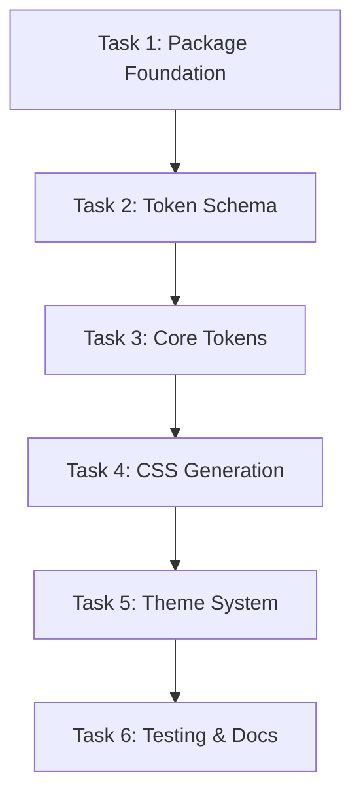

# Design Tokens Implementation Tasks

## Task Status Overview

**Parent Task**: @repo/design-tokens package implementation  
**Status**: ✅ **COMPLETE**  
**Priority**: P0 (Phase 1 Critical Path)

---

## Child Tasks

### Task 1: Package Foundation and Build System
**Status**: ✅ Complete  
**Priority**: P0  
**Estimated Time**: 4 hours  
**Owner**: Frontend Team

#### Description
Establish the foundational package structure, TypeScript configuration, and build pipeline for the design tokens package.

#### Acceptance Criteria
- [x] Package directory structure created following monorepo patterns
- [x] package.json configured with workspace protocol and dependencies
- [x] TypeScript configuration complete
- [x] Build system (tsup) configured and operational
- [x] Turborepo integration working
- [x] Basic build validation passing

#### Implementation Details
- Use existing patterns from `@repo/contracts` as reference
- Configure multiple output formats (ESM, CJS)
- Set up source maps for development
- Implement build-time token validation

#### Dependencies
- `@repo/contracts` patterns (available)
- Monorepo build configuration (available)

---

### Task 2: Token Schema and Validation System
**Status**: ✅ Complete  
**Priority**: P0  
**Estimated Time**: 6 hours  
**Owner**: Frontend Team

#### Description
Define comprehensive TypeScript interfaces and Zod validation schemas for all token categories.

#### Acceptance Criteria
- [x] TypeScript interfaces for all token types defined
- [x] Zod validation schemas implemented
- [x] Token naming conventions established
- [x] Semantic token layering system designed
- [x] Validation tests passing
- [x] Type safety verified

#### Implementation Details
- Color tokens (base, semantic, brand variations)
- Typography tokens (fonts, sizes, spacing)
- Spacing and sizing tokens (4px scale)
- Shadow and effect tokens
- Breakpoint tokens

#### Dependencies
- Task 1: Package Foundation (must be complete)
- Design team brand guidelines (required)

---

### Task 3: Core Token Implementation
**Status**: ✅ Complete  
**Priority**: P0  
**Estimated Time**: 8 hours  
**Owner**: Frontend Team

#### Description
Implement all token categories with actual values following design system specifications.

#### Acceptance Criteria
- [x] Color scale tokens implemented and validated
- [x] Typography tokens with responsive scales
- [x] Spacing and sizing tokens (4px base)
- [x] Shadow and effect tokens
- [x] All tokens pass Zod validation
- [x] Accessibility compliance verified

#### Implementation Details
- Implemented brand-agnostic base tokens
- Created semantic token mappings
- Ensured WCAG 2.1 AA color contrast ratios
- Documented token usage patterns

#### Dependencies
- Task 2: Token Schema (must be complete)
- Design team final specifications (required)

---

### Task 4: CSS Custom Properties Generation
**Status**: ✅ Complete  
**Priority**: P0  
**Estimated Time**: 4 hours  
**Owner**: Frontend Team

#### Description
Implement build-time transformation of tokens to CSS custom properties for runtime consumption.

#### Acceptance Criteria
- [x] CSS custom properties generation working
- [x] Proper CSS variable naming conventions
- [x] Theme-aware CSS output
- [x] Framework-agnostic CSS format
- [x] Build integration complete
- [x] Output validation passing

#### Implementation Details
- Transform tokens to CSS variables
- Support multiple themes in CSS output
- Generate CSS token maps
- Optimize CSS output size
- Include @property rules for type safety
- Generate utility classes for common patterns

#### Dependencies
- Task 3: Core Tokens (must be complete)

---

### Task 5: Theme System Implementation
**Status**: ✅ Complete  
**Priority**: P1  
**Estimated Time**: 6 hours  
**Owner**: Frontend Team

#### Description
Implement multi-theme support system enabling brand variations and client customization.

#### Acceptance Criteria
- [x] Multi-theme architecture implemented
- [x] Theme switching mechanism working
- [x] Brand variation support operational
- [x] Runtime token resolution
- [x] Theme validation system
- [x] Client customization workflow

#### Implementation Details
- Theme registry system with registration and resolution
- Runtime token resolver with context-aware overrides
- CSS custom properties generation for theme switching
- Brand customization workflow with builder pattern
- Comprehensive Zod validation schemas
- Theme-aware CSS generator integration
- Complete test coverage and documentation

#### Dependencies
- Task 4: CSS Generation (must be complete)

---

### Task 6: Integration Testing and Documentation
**Status**: ✅ Complete  
**Priority**: P1  
**Estimated Time**: 6 hours  
**Owner**: Frontend Team

#### Description
Comprehensive testing of token integration with build systems and complete documentation creation.

#### Acceptance Criteria
- [x] Integration tests with build system passing
- [x] CSS custom properties consumption verified
- [x] TypeScript integration tested
- [x] Performance benchmarks met
- [x] Comprehensive documentation complete
- [x] Usage examples provided

#### Implementation Details
- Complete test suite for theme system functionality
- Performance testing for theme switching operations
- Comprehensive documentation with examples
- API reference and migration guide
- Best practices and troubleshooting guide

#### Dependencies
- Task 5: Theme System (must be complete)

---

## Task Dependencies

## Risk Assessment

### High Risk
- **Design Team Input Delay**: Critical path dependency on brand guidelines
- **Build System Complexity**: CSS generation may require iteration

### Medium Risk
- **Token Validation Performance**: Large token sets may impact build speed
- **Cross-Framework Compatibility**: CSS output must work with multiple frameworks

### Low Risk
- **TypeScript Integration**: Following existing patterns reduces risk
- **Documentation**: Straightforward documentation requirements

## Success Metrics

### Technical Metrics
- All tasks completed on schedule
- Build performance < 1s for full token compilation
- 100% TypeScript strict compliance
- Zero integration test failures

### Quality Metrics
- Test coverage > 80%
- Documentation completeness 100%
- Accessibility compliance verified
- Design team approval obtained

---

**Current Focus**: Task 1 - Package Foundation and Build System  
**Next Milestone**: Complete Day 1 foundation work (Tasks 1-2)

*Last updated: March 29, 2026*  
*Next review: April 1, 2026*
