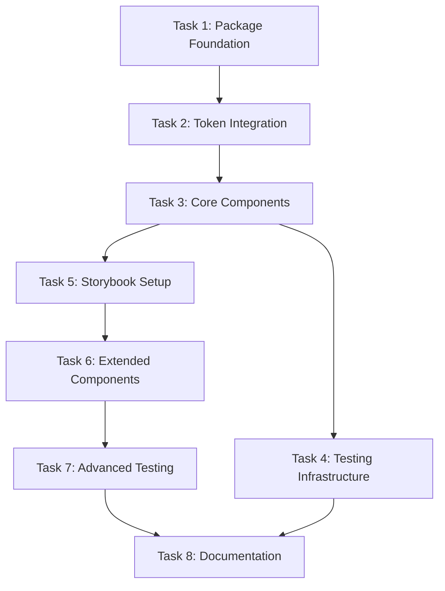

# UI Package Implementation Tasks

## Task Status Overview

**Parent Task**: @repo/ui package implementation  
**Status**: 🔄 **IN PROGRESS**  
**Priority**: P1 (Phase 1 Critical Path)

**Progress**: 2/8 tasks complete (25%)

---

## Child Tasks

### Task 1: Package Foundation and Build System
**Status**: ✅ Complete  
**Priority**: P0  
**Estimated Time**: 6 hours  
**Owner**: Frontend Team

#### Description
Establish the foundational package structure, TypeScript configuration, and build pipeline for the UI package.

#### Acceptance Criteria
- [x] Package directory structure created following monorepo patterns
- [x] package.json configured with workspace protocol and dependencies
- [x] TypeScript configuration complete with strict mode
- [x] Build system (tsup) configured and operational
- [x] Turborepo integration working
- [x] Basic build validation passing

#### Implementation Details
- Use existing patterns from `@repo/design-tokens` as reference
- Configure multiple output formats (ESM, CJS)
- Set up source maps for development
- Implement build-time token validation
- Configure development build watch mode

#### Dependencies
- `@repo/design-tokens` package (complete)
- Monorepo build configuration (available)

---

### Task 2: Design Token Integration and Theme System
**Status**: ✅ Complete  
**Priority**: P0  
**Estimated Time**: 8 hours  
**Owner**: Frontend Team

#### Description
Integrate with the design token system and establish token-driven styling patterns with theme support.

#### Acceptance Criteria
- [x] Design token integration working with `@repo/design-tokens`
- [x] Theme system foundation implemented
- [x] CSS custom properties generation working
- [x] Token validation at build time
- [x] Theme switching mechanism functional
- [x] CSS variable naming conventions established

#### Implementation Details
- Import and use design tokens for all styling
- Create theme-aware styling system
- Implement CSS custom properties generation
- Build token validation into the build process
- Create theme switching infrastructure
- Ensure no hardcoded values in components

#### Dependencies
- Task 1: Package Foundation (must be complete)
- `@repo/design-tokens` package (complete)

---

### Task 3: Core Primitive Components
**Status**: ✅ Complete  
**Priority**: P0  
**Estimated Time**: 12 hours  
**Owner**: Frontend Team

#### Description
Implement the essential primitive components that form the foundation of the UI library.

#### Acceptance Criteria
- [x] Button component with variants, sizes, and states
- [x] Input component with multiple input types
- [x] Container component with spacing tokens
- [x] Text component with semantic typography roles
- [x] Icon component with sizing tokens
- [x] All components use token-driven styling
- [x] Accessibility features implemented
- [x] Component API consistency achieved

#### Implementation Details
- Button: primary, secondary, outline variants; sm, md, lg sizes
- Input: text, email, password, number types with validation states
- Container: layout containers with consistent spacing patterns
- Text: typography component with semantic token mapping
- Icon: icon wrapper with size and color token integration
- Consistent prop interfaces across all components
- Accessibility attributes built-in (ARIA, keyboard navigation)
- TypeScript-first implementation with comprehensive types

#### Dependencies
- Task 2: Token Integration (must be complete)

---

### Task 4: Component Testing Infrastructure
**Status**: ✅ Complete  
**Priority**: P1  
**Estimated Time**: 8 hours  
**Owner**: Frontend Team

#### Description
Establish comprehensive testing patterns and infrastructure for all UI components.

#### Acceptance Criteria
- [x] Unit test suite for all components
- [x] Accessibility testing integration
- [x] Component interaction tests
- [x] Token integration tests
- [x] Test coverage >80% achieved
- [x] Continuous integration testing working

#### Implementation Details
- Unit tests for component rendering and props
- Accessibility tests using axe-core or similar
- Integration tests for component composition
- Token integration and theme switching tests
- Performance benchmarks for components
- Visual regression testing foundation

#### Dependencies
- Task 3: Core Components (must be complete)

---

### Task 5: Storybook Setup and Documentation
**Status**: ⏳ Not Started  
**Priority**: P1  
**Estimated Time**: 8 hours  
**Owner**: Frontend Team

#### Description
Set up Storybook for component documentation, visual testing, and developer experience.

#### Acceptance Criteria
- [ ] Storybook development server running
- [ ] Stories for all core components
- [ ] Interactive controls for component props
- [ ] Accessibility testing integration
- [ ] Component documentation complete
- [ ] Design token usage documentation

#### Implementation Details
- Storybook configuration with React support
- Stories for all component variants and states
- Controls addon for interactive prop testing
- Accessibility addon for a11y testing
- Design token documentation in stories
- Usage examples and best practices

#### Dependencies
- Task 3: Core Components (must be complete)

---

### Task 6: Extended Component Library
**Status**: ⏳ Not Started  
**Priority**: P1  
**Estimated Time**: 10 hours  
**Owner**: Frontend Team

#### Description
Implement the remaining primitive components to complete the core UI library.

#### Acceptance Criteria
- [ ] Link component with styling variants
- [ ] Card component for content containers
- [ ] Badge component for status indicators
- [ ] Avatar component for user avatars
- [ ] Separator component for visual dividers
- [ ] All components follow established patterns
- [ ] Accessibility compliance verified
- [ ] Component documentation complete

#### Implementation Details
- Link: styled link component with hover states
- Card: content container with consistent styling
- Badge: small status indicators with color variants
- Avatar: user avatar with fallback handling
- Separator: visual dividers with spacing tokens
- Maintain consistency with core components
- Full accessibility implementation
- Complete Storybook documentation

#### Dependencies
- Task 3: Core Components (must be complete)
- Task 5: Storybook Setup (must be complete)

---

### Task 7: Advanced Testing and Visual Regression
**Status**: ⏳ Not Started  
**Priority**: P1  
**Estimated Time**: 8 hours  
**Owner**: Frontend Team

#### Description
Implement advanced testing including visual regression testing and comprehensive accessibility validation.

#### Acceptance Criteria
- [ ] Visual regression testing with Chromatic
- [ ] Comprehensive accessibility testing
- [ ] Cross-browser compatibility testing
- [ ] Performance testing for components
- [ ] Integration testing with build system
- [ ] Automated testing pipeline working

#### Implementation Details
- Chromatic integration for visual regression testing
- Automated accessibility testing in CI/CD
- Cross-browser testing setup
- Component performance benchmarking
- Build system integration testing
- Automated test reporting and coverage

#### Dependencies
- Task 6: Extended Components (must be complete)
- Task 5: Storybook Setup (must be complete)

---

### Task 8: Documentation and Developer Experience
**Status**: ⏳ Not Started  
**Priority**: P1  
**Estimated Time**: 6 hours  
**Owner**: Frontend Team

#### Description
Complete comprehensive documentation and optimize developer experience for the UI package.

#### Acceptance Criteria
- [ ] Complete README with getting started guide
- [ ] API documentation for all components
- [ ] Usage examples and patterns documented
- [ ] Design token integration guide
- [ ] Accessibility guidelines documented
- [ ] Developer experience validation complete

#### Implementation Details
- Comprehensive README with installation and usage
- API reference for all components and props
- Usage examples for common patterns
- Design token integration documentation
- Accessibility implementation guide
- Performance optimization guidelines
- Migration guide if needed

#### Dependencies
- Task 7: Advanced Testing (must be complete)
- All previous tasks must be complete

---

## Task Dependencies

## Daily Implementation Plan

### Day 1: Foundation (8 hours)
- **Morning (4 hours)**: Task 1 - Package Foundation and Build System
  - Package structure setup
  - TypeScript configuration
  - Build system configuration
  - Turborepo integration

- **Afternoon (4 hours)**: Task 2 - Design Token Integration (start)
  - Token integration setup
  - Theme system foundation
  - CSS custom properties generation

### Day 2: Token Integration and Core Components (8 hours)
- **Morning (4 hours)**: Task 2 - Design Token Integration (complete)
  - Complete theme system
  - Token validation
  - Theme switching mechanism

- **Afternoon (4 hours)**: Task 3 - Core Components (start)
  - Button component implementation
  - Input component implementation

### Day 3: Core Components (8 hours)
- **Morning (4 hours)**: Task 3 - Core Components (continue)
  - Container component
  - Text component
  - Icon component

- **Afternoon (4 hours)**: Task 3 - Core Components (complete)
  - Component API consistency
  - Accessibility implementation
  - TypeScript types completion

### Day 4: Testing and Storybook (8 hours)
- **Morning (4 hours)**: Task 4 - Component Testing Infrastructure
  - Unit test setup
  - Accessibility testing
  - Test coverage implementation

- **Afternoon (4 hours)**: Task 5 - Storybook Setup
  - Storybook configuration
  - Component stories
  - Documentation setup

### Day 5: Extended Components (8 hours)
- **Morning (4 hours)**: Task 6 - Extended Component Library (start)
  - Link component
  - Card component
  - Badge component

- **Afternoon (4 hours)**: Task 6 - Extended Component Library (complete)
  - Avatar component
  - Separator component
  - Component documentation

### Day 6: Advanced Testing (8 hours)
- **Morning (4 hours)**: Task 7 - Advanced Testing (start)
  - Visual regression testing
  - Cross-browser testing
  - Performance testing

- **Afternoon (4 hours)**: Task 7 - Advanced Testing (complete)
  - Integration testing
  - Automated testing pipeline
  - CI/CD integration

### Day 7: Documentation and Finalization (8 hours)
- **Morning (4 hours)**: Task 8 - Documentation and Developer Experience
  - README completion
  - API documentation
  - Usage examples

- **Afternoon (4 hours)**: Task 8 - Documentation and Developer Experience (complete)
  - Final documentation review
  - Developer experience validation
  - Package preparation for release

---

## Risk Assessment

### High Risk
- **Design Token Integration Complexity**: Risk of integration issues with design tokens
  - *Mitigation*: Early coordination with design-tokens team, comprehensive testing

- **Accessibility Implementation Scope**: Risk of incomplete accessibility features
  - *Mitigation*: Automated testing, manual verification, accessibility audit

### Medium Risk
- **Component API Consistency**: Risk of inconsistent component patterns
  - *Mitigation*: Clear design patterns, code review, API documentation

- **Performance Impact**: Risk of heavy component implementations
  - *Mitigation*: Performance testing, bundle size monitoring, optimization

### Low Risk
- **Build System Integration**: Risk of build system issues
  - *Mitigation*: Follow existing patterns, test integration early

- **Storybook Configuration**: Risk of documentation setup issues
  - *Mitigation*: Use standard Storybook configuration, test early

---

## Success Metrics

### Technical Metrics
- All tasks completed on schedule (7 days)
- Build performance < 2s for full package build
- Test coverage > 80% for all components
- 100% TypeScript strict compliance
- Zero integration test failures

### Quality Metrics
- WCAG 2.1 AA compliance for all components
- Visual regression tests passing
- Component API consistency verified
- Documentation completeness 100%
- Developer experience validated

### Integration Metrics
- Design token integration working seamlessly
- Storybook documentation complete and functional
- Build system integration with Turborepo working
- Automated testing pipeline operational

---

## Quality Assurance Checklist

### Before Task Completion
- [ ] Code follows monorepo patterns and conventions
- [ ] TypeScript strict mode compliance
- [ ] All components use design tokens (no hardcoded values)
- [ ] Accessibility features implemented and tested
- [ ] Component APIs are consistent and well-documented
- [ ] Build system integration working
- [ ] Test coverage meets requirements

### Before Package Completion
- [ ] All tasks completed successfully
- [ ] Integration tests passing
- [ ] Documentation complete and accurate
- [ ] Performance benchmarks met
- [ ] Accessibility audit passed
- [ ] Build and deployment pipeline working

---

## Handoff Criteria

The UI package implementation is considered complete and ready for handoff when:

1. **All Tasks Complete**: All 8 tasks are marked as complete with acceptance criteria met
2. **Testing Comprehensive**: Unit, integration, accessibility, and visual tests all passing
3. **Documentation Complete**: Full documentation with examples and API reference
4. **Integration Verified**: Seamless integration with design tokens and build system
5. **Quality Assured**: Code quality, accessibility, and performance standards met
6. **Developer Experience**: Easy to use and integrate for consuming applications

---

**Current Focus**: Task 3 - Core Primitive Components  
**Next Milestone**: Complete Day 2-3 component implementation (Task 3)

*Last updated: March 29, 2026*  
*Next review: April 2, 2026*
